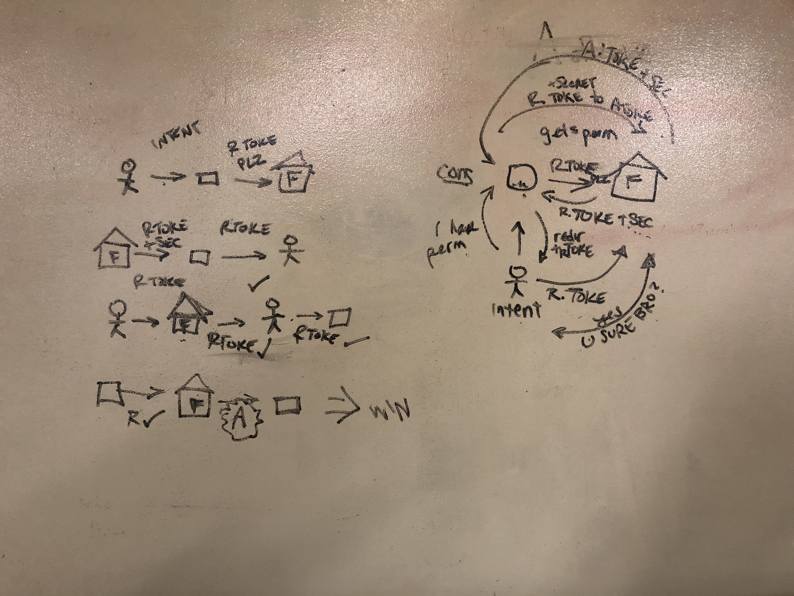

# LAB - Class 13


## Server with Oauth functionality. 

### Use FB to log into you account!

### Description


### Author: Tyler Sayvetz and Peter Cole

## Links and Resources

- [Submission PR]()


## Dependencies
  ```
   

  ```

 ### Environment Variables Needed

- `PORT=3000`
- `MONGODB_URI=mongodb://localhost:27017/users`
- `SECRET`
- `FACEBOOK_APP_CLIENT_SECRET=`
- 

### How to initialize/run your application
The following assumes you have an installation of MongoDB. Refer to MongoDB docs if you need to install. 


### Tests

Testing to come.

### UML


Web RRC diagram for basic Oauth server. The 'triangle of love'

